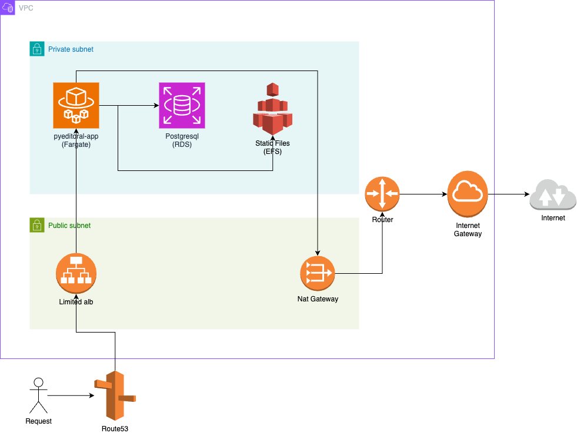

# PyEditorial
A free, open-source Blog CMS based on the "Django" and "Editorial" HTML5 theme.

This project is forked from https://github.com/mavenium/PyEditorial.

It is developed for local development and production environment. 

Deployment uses Gunicorn, Nginx and PostgreSQL. Each running on its own container.


------------
### Run with Docker

For local development, project use .env.dev file, entrypoint.sh and Dockerfile. 

If you want to update configuration, you can update those files.

1. Install Docker on your operating system
2. Install docker-compose on your operating system
3. Run the following command to create and run the project
```
docker-compose up [-d]
```
3. Go to  `http://127.0.0.1:8000/` or just type `localhost:8000` in your browser to use project
------------


### Architecture Diagram



Terraform implementations deploy a VPC, an Application Load Balancer, EFS File System, RDS PostgreSql Database, ECS Cluster and Service and necessary IAM resources.

Stores the state as a given key in a given bucket on Amazon S3. 

This backend also supports state locking and consistency checking via Dynamo DB, which can be enabled by setting the dynamodb_table field to an existing DynamoDB table name. Those are defined on [provider.tf](./terraform/provider.tf)


------------

### Deployment

For deployment, project has build and deploy workflows. 

- [Build](.github/workflows/build.yaml):

  This workflow is using to build docker image and push ECR repository. 
  
  If you open a pull request for main branch, build workflow is triggered automatically.

- [Deploy](.github/workflows/deploy-to-ecs.yaml):

  This workflow is using for deploying to Fargate with built image. 
  
  If you comment as `!deploy` command on pull request, deploy workflow is triggered automatically.